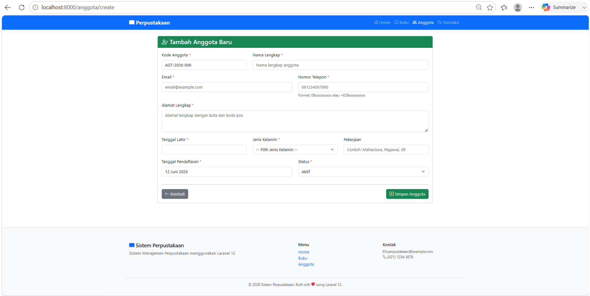
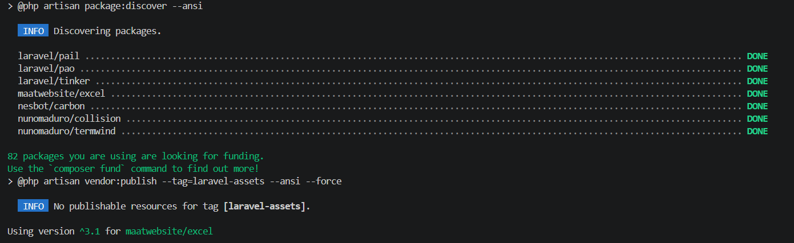
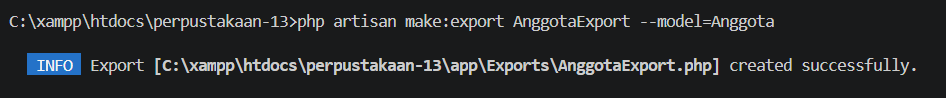
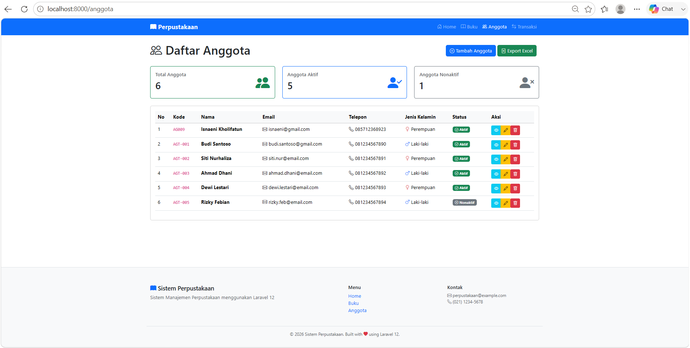
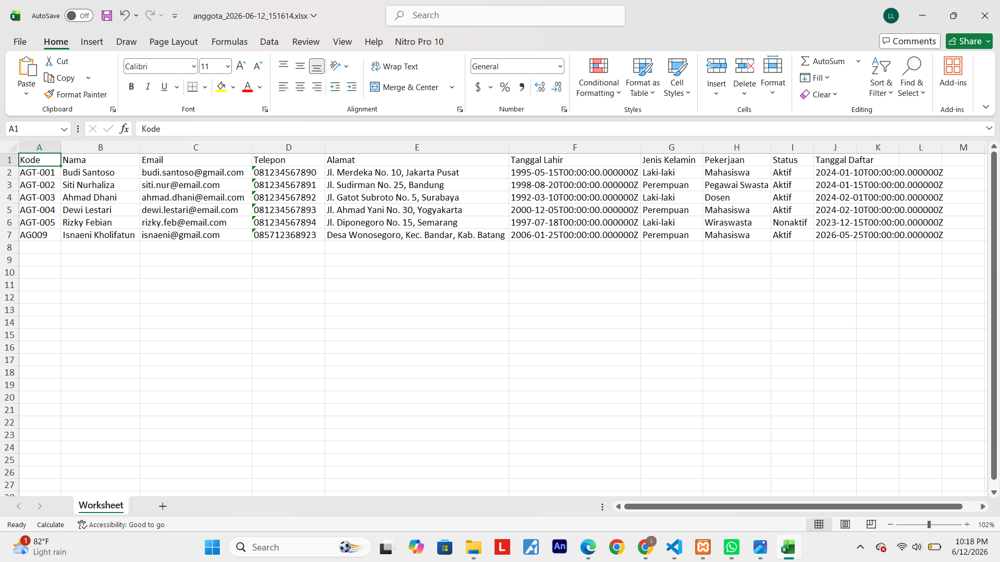
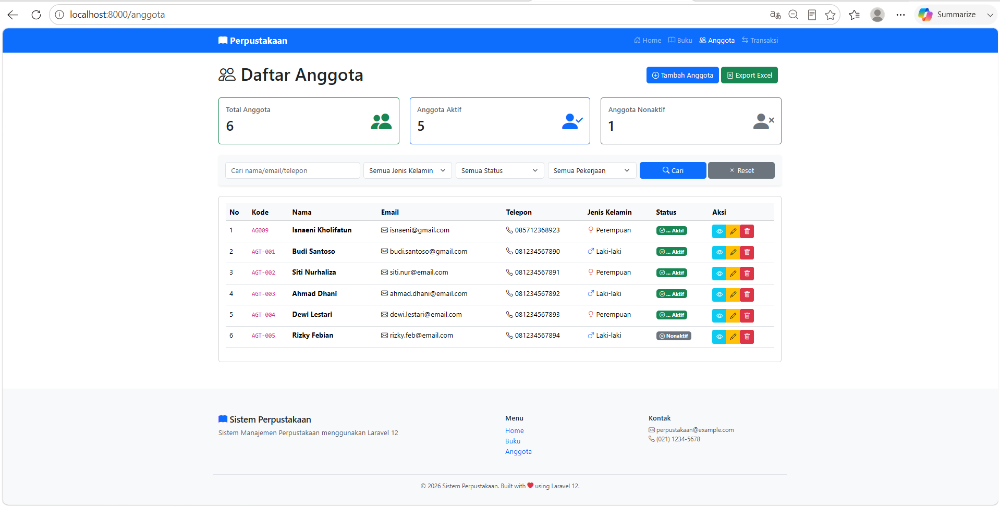
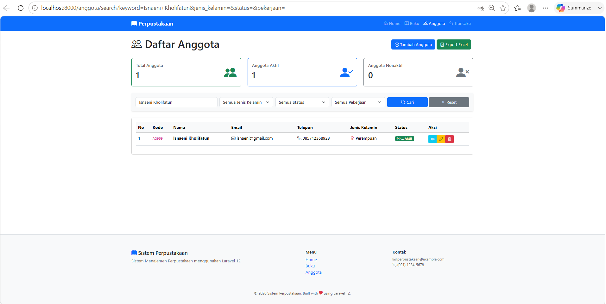

# Tugas Pertemuan 13 - CRUD Anggota Dengan Laravel

---

**Nama:** Isnaeni Kholifatun  
**NIM:** 60324075  
**Prodi:** Informatika  
**Semester:** 4  
**Mata Kuliah:** Pemrograman Web II  
**Repository:** [https://github.com/isnaenikholifatun/Tugas-Pertemuan-13-CRUD-ANGGOTA-DENGAN-LARAVEL/tree/main/tugas-pertemuan13]

---

## Tugas 1 : Auto-Generate Kode Anggota
---
**Fitur yang ditambahkan:**
**Implementasi auto-generate kode anggota dengan format:**
* `AGT-[TAHUN]-[NOMOR_URUT]`
---
#### contoh
* AGT-2026-001
* AGT-2026-002
* AGT-2026-003
---

#### Screenshoot Hasil Auto Generate Kode

---

## Tugas 2 : Export Anggota Ke Excel
**fitur export data anggota ke file Excel menggunakan package Laravel Excel (maatwebsite/excel):**
---
#### Install Package:
* `composer require maatwebsite/excel`
---
#### Screenshoot Hasil Install

---

#### Buat Export Class:
* `php artisan make:export AnggotaExport --model=Anggota`
#### Screenshoot Hasil Install

---

#### Fitur Export CSV:
* Export seluruh data anggota ke Excel
* Downdload file otomatis (.xlsx)
* Dapat dibuka menggunakan Microsoft Excel
---
#### Data Yang Diexport:
* Kode Anggota
* Nama
* Email
* Telepon
* Alamat
* Tanggal Lahir
* Jenis Kelamin
* Pekerjaan
*  Status
* Tanggal Daftar
---
#### Screenshoot Hasil Tampilan Export CSV

#### Screenshoot Hasil Export CSV

## Tugas 3 : Advanced Search & Filter

**Fitur Search:**
* Nama
* Email
* Telepon
---

**Fitur Filter:**
* Jenis Kelamin
* Status
* Pekerjaan

---

#### Screenshoot Tampilan Filter dan Search

#### Screenshoot Outpput Pencarian data Berdasarkan `Nama`
